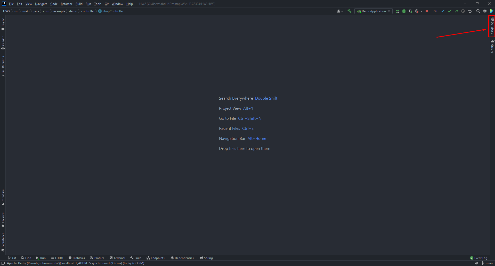
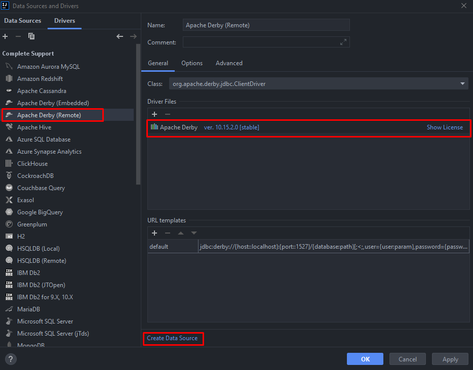
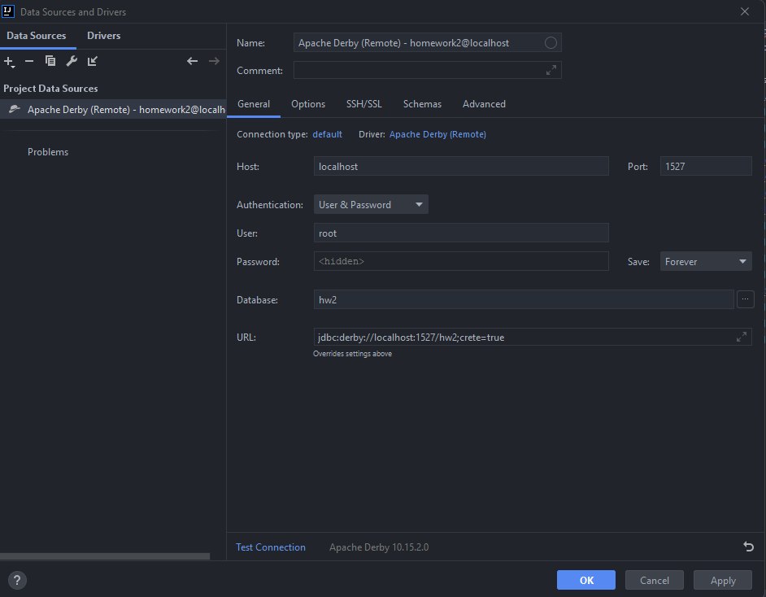
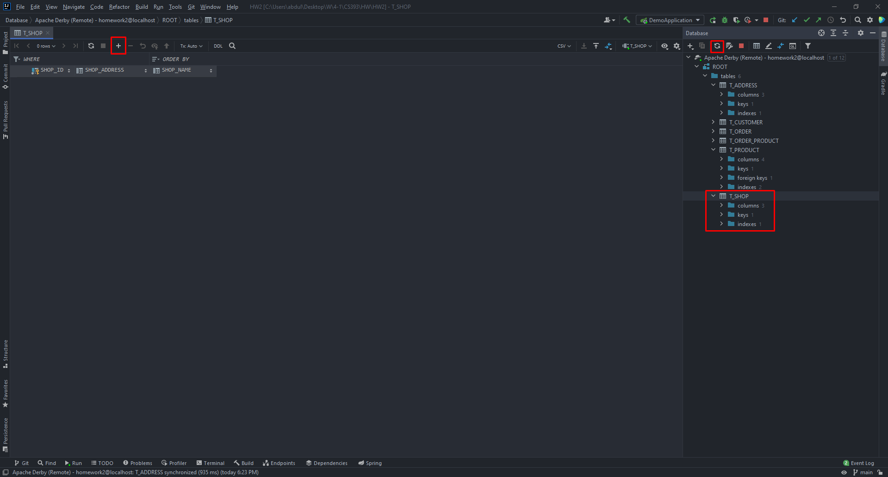
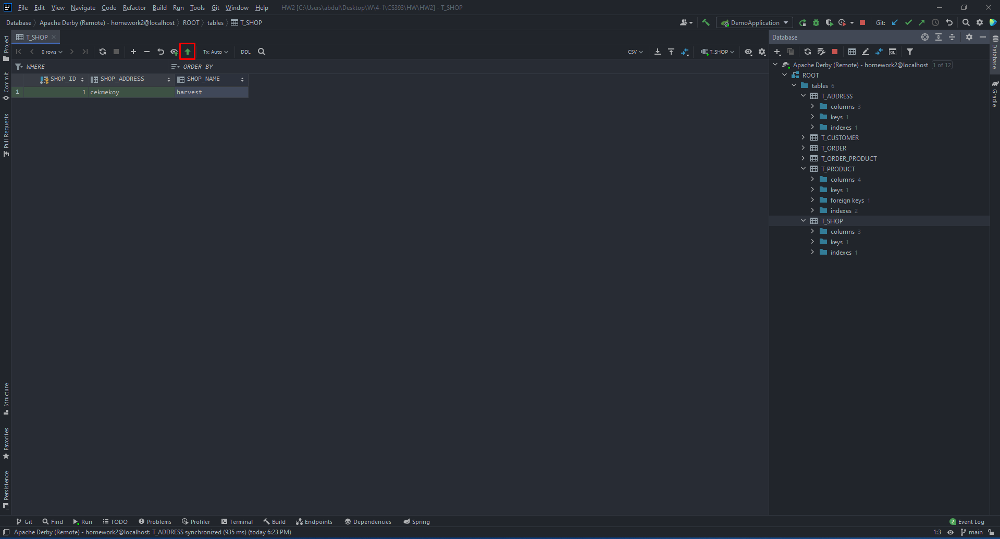

# CS393 - HW2
This is the repository for HW2 of CS393 Developing Backend Applications with Spring Framework course given by [Esma Meral](https://github.com/esmameral) at [Ozyegin University](https://www.ozyegin.edu.tr). Code is written by [Abdullah Saydemir](https://github.com/Saydemr) and will be available after the deadline via [this link](https://github.com/Saydemr/CS393/tree/main/HW2).
 
### Pre-requisites
- [Java SE 11](https://www.oracle.com/tr/java/technologies/javase/jdk11-archive-downloads.html)
- [IntelliJ IDEA](https://www.jetbrains.com/idea/download)
- [Derby DB v10.15.2.0](https://db.apache.org/derby/derby_downloads.html)
  - Download the `db-derby-10.15.2.0-bin.zip` archive (`db-derby-10.15.2.0-bin.tar.gz` if you are using Unix/Linux) from the link above.
  - Run the server by double-clicking on `startNetworkServer.bat` file inside `bin` directory. You can use `.jar` file with the similar name if you downloaded the `.tar.gz` version.
 
### Configurations
- To connect IntelliJ IDEA to Derby DB:
  - Click `Database` tab in the top-right corner of the IDE. 
  - Click `+  -> Data Source` and choose `Apache Derby` from the dropdown menu.
  - From drivers tab choose `Apache Derby (Remote)` and download the ClientDriver. Then click on `Create Data Source`. 
  - Adjust the configurations according to below image. 
  - Click on `Apply` and `OK`.
  - You can now use the query console and tables directly from IntelliJ IDEA.
 
### Adding Records to DB
- Use the `Database` tab in the top right corner of the IDE.
- Click on refresh to update the tables. Choose the table you would like to insert records into and double click onto it. Then, click on `+` icon on the top middle bar. 
- After filling the necessary fields, click on upwards arrow to save the data. 
 

### Running the Code
- Assuming you have already extracted the zip file since this file is open, find `gradle.build` inside the `HW2` directory and run it.
- Navigate to `src/main/java/com/example/demo` and run `Application.java` with IntelliJ IDEA.
- If you have `data.sql` file you can configure `application.properties` to initialize the database with the specific instances in the tables.
 

### REST Services
- REST services are implemented only for `Shop` class. Others will throw a bunch of errors if you try to use them. Default URL is : `http://localhost:8080/`

1. To `GET` all shops: GET `http://localhost:8080/shops`
2. To `GET` a specific shop with a specific `id`: GET `http://localhost:8080/shops/{id}` 
3. To `DELETE` a specific shop with a specific `id`: DELETE `http://localhost:8080/shops/{id}`
4. To `POST` a new shop to the server:
   1. Have a body in the following form  
      {  
      &nbsp;&nbsp;&nbsp;&nbsp;"address" : <address-text>,  
      &nbsp;&nbsp;&nbsp;&nbsp;"name" : <name-of-shop>  
      }  
   2. Use : POST `http://localhost:8080/shops`
